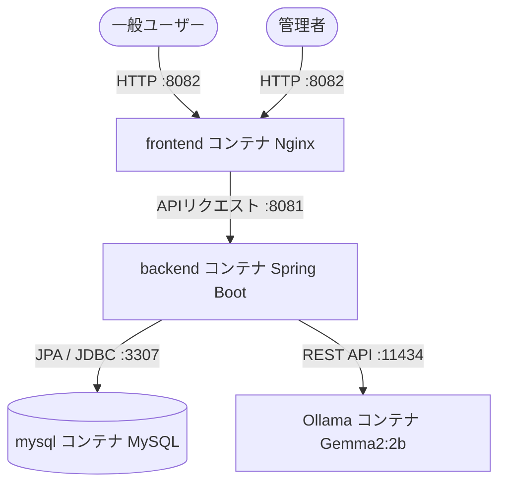

# 🗺️ cit-map-project(1033) - 特産品マップ ＆ AI評価分析システム 完全仕様書

本ドキュメントは、関東地方特産品マップアプリケーションに「ユーザー評価管理機能」および「Gemma2によるAI分析ダッシュボード」を統合した **機能拡張版（Attackパターン / 1033版）** の全画面、バックエンドアーキテクチャ、API、セキュリティ対策、データ構造について網羅的に解説した完全仕様書です。

---

## 🏛️ 1. システム全体概要とアーキテクチャ

本システムは、Dockerコンテナ化されたマルチサービスアーキテクチャで構成されており、ローカル環境で高速かつセキュアに動作します。
一般ユーザーが特産品を検索・評価する機能と、管理者がそのデータをセキュアに管理・AI分析する機能を兼ね備えています。



### 🖥️ 採用技術スタック
*   **フロントエンド:** Vanilla HTML5, CSS3 (プレミアムダーク/ネオンテーマ), Vanilla JavaScript (ES6+), `marked.js` (AIレポートのMarkdownパース用)
*   **バックエンド:** Spring Boot 3.2.5 (Java 21), Spring Data JPA, Hibernate Core
*   **データベース:** MySQL 8.0 (永続化ボリュームマウント適用)
*   **AI分析基盤:** Ollama (ローカルホスト稼働) + **Gemma2:2b** モデル
*   **インフラ:** Docker & Docker Compose (マルチコンテナネットワーク)

---

## 📂 2. ディレクトリ構造とコンテナ・ポート設定

本プロジェクト（1033版）は、通常版（1021）と同時に起動しても干渉しないよう、ポート番号とコンテナ名を完全に独立させています。階層構造は通常版に寄せて設計されています。

```text
cit-map-project(1033)/
 ├── docker-compose.yml       # 1033版専用のDocker設定
 ├── mysql/                   # データベース初期化SQL群（insert_specialties.sql等）
 ├── README.md                # 本仕様書
 └── map-project/             # アプリケーション本体ディレクトリ
      ├── frontend/           # フロントエンドソースコード (旧 app/frontend)
      ├── backend/            # バックエンドソースコード (旧 app/backend)
      └── ...
```

### 🐳 コンテナ・ポートマッピング詳細
`docker-compose up -d --build` 実行時、以下の設定で立ち上がります。

| サービス | コンテナ名 | ホスト側ポート (左) | コンテナ側ポート (右) | 役割 |
| :--- | :--- | :--- | :--- | :--- |
| **Frontend** | `map-project-frontend-1033` | **`8082`** | `80` | クライアントへの静的ファイル配信 (Nginx) |
| **Backend** | `map-project-backend-1033` | **`8081`** | `8080` | API処理、DB操作、AI通信 (Spring Boot) |
| **Database** | `map-project-db-1033` | **`3307`** | `3306` | データ永続化 (MySQL) |

---

## 📱 3. 一般公開画面 仕様 (Frontend - Public)

一般公開用マップ画面（`http://localhost:8082/index.html`）は、特産品の検索とユーザーからのフィードバック収集を行います。

### 3.1 特産品検索機能
*   関東地方の特産品をカテゴリや県別に検索可能。
*   検索リクエストはバックエンドの `/api/search` を呼び出します。

### 3.2 評価入力ツール (Rating Form)
画面最下部に配置されたフィードバック収集用UI。
*   **動的星評価セレクタ (Star Selector):**
    *   ★1から★5までの5つの星アイコン（`⭐`）を配置。
    *   ホバー時およびクリック時に、選択された星以下のすべての星がゴールドに輝き、右側に「大変満足」「不満」などの動的なテキストフィードバックをリアルタイム表示。
*   **コメント入力エリア (Comment Textarea):**
    *   ユーザーが任意の意見を入力できるプレースホルダー付き入力欄。
    *   クライアント側・サーバー側双方で **「最大1000文字」** のバリデーション制限を適用。
*   **送信処理:**
    *   「評価を送信する」ボタン押下時、送信中はボタンを無効化（Double Submit防止）。
    *   結果は画面上部の美麗なフェードイン/フェードアウトトースト（`Toast`）で動的に通知。

---

## 🔐 4. 管理者ダッシュボード 仕様 (Admin Dashboard)

管理者画面（`http://localhost:8082/admin.html`）は、特産品データと評価データを管理・分析するセキュアな拠点です。

### 4.1 ログイン認証システム
*   **認証情報:** ID: `admin` / Password: `cit_DXproject.1024`
*   **アクセス制御:** 有効なセッションが存在しない場合はダッシュボードを完全に非表示（`display: none`）にし、暗黒のログインフォームのみをレンダリング。
*   **セッション保護:** 認証成功時、`HttpOnly` および `SameSite=Strict` 属性を持つ256ビットのランダムトークン（`ADMIN_SESSION`）を発行。フロントエンドのJSからの読み取りや、クロスサイトリクエストを完全に遮断。

### 4.2 タブ1: 特産品管理 (Specialty Management)
*   **データCRUD:** 特産品の登録、一覧表示、編集、削除を行うメインインターフェース。
*   **モーダル設計:** 編集および新規作成は、ダッシュボードの背景を暗くぼかす（`backdrop-filter: blur(8px)`）プレミアムなガラスモルフィズムモーダル上で実行。

### 4.3 タブ2: 評価コメント管理 (Ratings & AI Analytics)
本システムの目玉となる、視覚的・インテリジェントな意思決定支援コンポーネントです。

#### ① 📊 美麗ドーナツ型円グラフ (Visual Distribution Chart)
*   **完全CSS描画:** 外部ライブラリ（Chart.js等）を一切使用せず、CSSの `conic-gradient` だけで描画。ブラウザの **CSP（コンテンツセキュリティポリシー）制限を完全に回避**。
*   **動的レンダリング:** 全データから★1〜★5の件数をリアルタイム集計し、各色（青、緑、黄、橙、赤）の比率をインラインで動的適用。
*   **ネオングローエフェクト:** グラフ外周に `filter: drop-shadow` を付与し、暗闇に浮かび上がるリングを演出。中央に平均点を表示。

#### ② 🌐 世界基準タイムゾーン自動追従テーブル (Ratings Table)
*   **UTC永続化:** データベース(MySQL)には `java.time.Instant` を用い、協定世界時（UTC）の絶対時刻で保存。
*   **自動ローカライズ:** フロントエンドでデータを描画する際、JavaScriptの `toLocaleString()` を使用して、**アクセス元の端末のタイムゾーン（日本ならJST）へ自動変換** して表示。

#### ③ 🤖 Gemma2 AI自動評価分析システム (AI Analytics)
*   **分析フロー:** ローカルで安全に稼働しているAIモデル **Gemma2**（Ollama経由）に対し、一括した統計データとユーザーの生コメントを瞬時に読み込ませて分析レポートを生成。
*   **プロンプト自動生成:** バックエンド側で「総評価数」「星の内訳」「平均点」「全ユーザーコメント」を結合し、「①全体サマリー、②ポジティブな意見、③ネガティブな改善点、④AIアドバイス の4セクションのMarkdownで出力せよ」というプロンプトを動的生成。
*   **Markdownパーサー:** AIから返却された生のMarkdownテキストを、`marked.js` を使用してHTMLへパースし、美しく画面展開。
*   **ハルシネーション警告UI:** AIが事実と異なる情報を生成するリスクに配慮し、レポート下部に警告カード（`⚠️ ご注意: AIはハルシネーションを生成する可能性があります`）を常時表示。

---

## 🛡️ 5. セキュリティアーキテクチャ (Security Design)

本システムは、多層防御（Defense in Depth）設計が施されています。

### 5.1 CSRF（クロスサイトリクエストフォージェリ）防御
*   **ダブルサブミットトークンパターン:** 管理者ログイン時、セッションとは別に暗号的に安全なCSRFトークンを生成し、フロントエンドへ渡します。
*   **ダブル検証:** データ変更を伴うリクエスト（POST, PUT, DELETE）時、リクエストヘッダー `X-CSRF-Token` とCookie内のトークンをサーバーで厳格に比較検証。不一致時は即座に `403 Forbidden` でブロック。

### 5.2 XSS（クロスサイトスクリプティング）防御
*   **HTMLエスケープ:** ユーザー入力（コメント等）をテーブル等に描画する際、JavaScript側で特殊文字（`&`, `<`, `>`, `"`, `'`）を完全に無害な文字実体参照に置換してレンダリング。

### 5.3 SQLインジェクション防御
*   **JPA PreparedStatement:** すべてのDBクエリは Spring Data JPA のプリペアドステートメントにより実行。ユーザー入力はパラメータ値としてのみ扱われ、SQL命令としては解釈されません。

---

## 💾 6. データベース構造 (Database Schema)

### `ratings` テーブル (評価管理)
| カラム名 | データ型 | 制約 | 説明 |
| :--- | :--- | :--- | :--- |
| `id` | `BIGINT` | `PK`, `AUTO_INCREMENT` | 評価データのユニークID |
| `rating` | `INT` | `NOT NULL` | 星評価数 (1〜5) |
| `comment` | `VARCHAR(1000)` | `DEFAULT ""` | ユーザーからの評価コメント |
| `created_at` | `TIMESTAMP(6)` | `NOT NULL` | 投稿日時 (世界標準時 UTC 保存) |

### `specialties` テーブル (特産品管理)
| カラム名 | データ型 | 制約 | 説明 |
| :--- | :--- | :--- | :--- |
| `id` | `BIGINT` | `PK`, `AUTO_INCREMENT` | 特産品のユニークID |
| `prefecture` | `VARCHAR(255)` | `NOT NULL` | 都道府県名 |
| `season` | `VARCHAR(255)` | `NOT NULL` | 旬の季節 |
| `name` | `VARCHAR(255)` | `NOT NULL` | 特産品名称 |
| `description` | `TEXT` | - | 特産品の解説 |
| `local_dish` | `VARCHAR(255)` | - | 関連する郷土料理 |
| `image_url` | `VARCHAR(2000)`| - | 画像URL |

---

## 🔌 7. REST API リファレンス (API Endpoints)

### 一般公開エンドポイント (認証不要)
*   **`POST /api/ratings`**
    *   概要: ユーザー評価の新規投稿
    *   Payload: `{"rating": 5, "comment": "素晴らしい！"}`

### 管理者エンドポイント (要セッション認証 ＆ CSRFトークン)
*   **`GET /api/ratings`**
    *   概要: 全評価データ一覧の取得（最新順）
*   **`DELETE /api/ratings/{id}`**
    *   概要: 指定したIDの評価を削除
*   **`POST /api/admin/ratings/analyze`**
    *   概要: Ollama(Gemma2)へのデータ送信と分析レポート（Markdown文字列）の取得
*   **`GET /api/specialties`** (他 CRUD API 略)

---

## 🏁 8. セットアップ手順

1. ターミナルで `cit-map-project(1033)` ディレクトリ（本ファイルがある場所）を開きます。
2. 以下のコマンドを実行し、コンテナをビルド・起動します。
   ```bash
   docker-compose up -d --build
   ```
3. 起動後、ブラウザからアクセスします。
   * 一般公開画面: `http://localhost:8082/`
   * 管理者ダッシュボード: `http://localhost:8082/admin.html`
     *(ID: admin / Pass: cit_DXproject.1024)*
4. コンテナを停止する場合は以下のコマンドを実行します。
   ```bash
   docker-compose down
   ```
