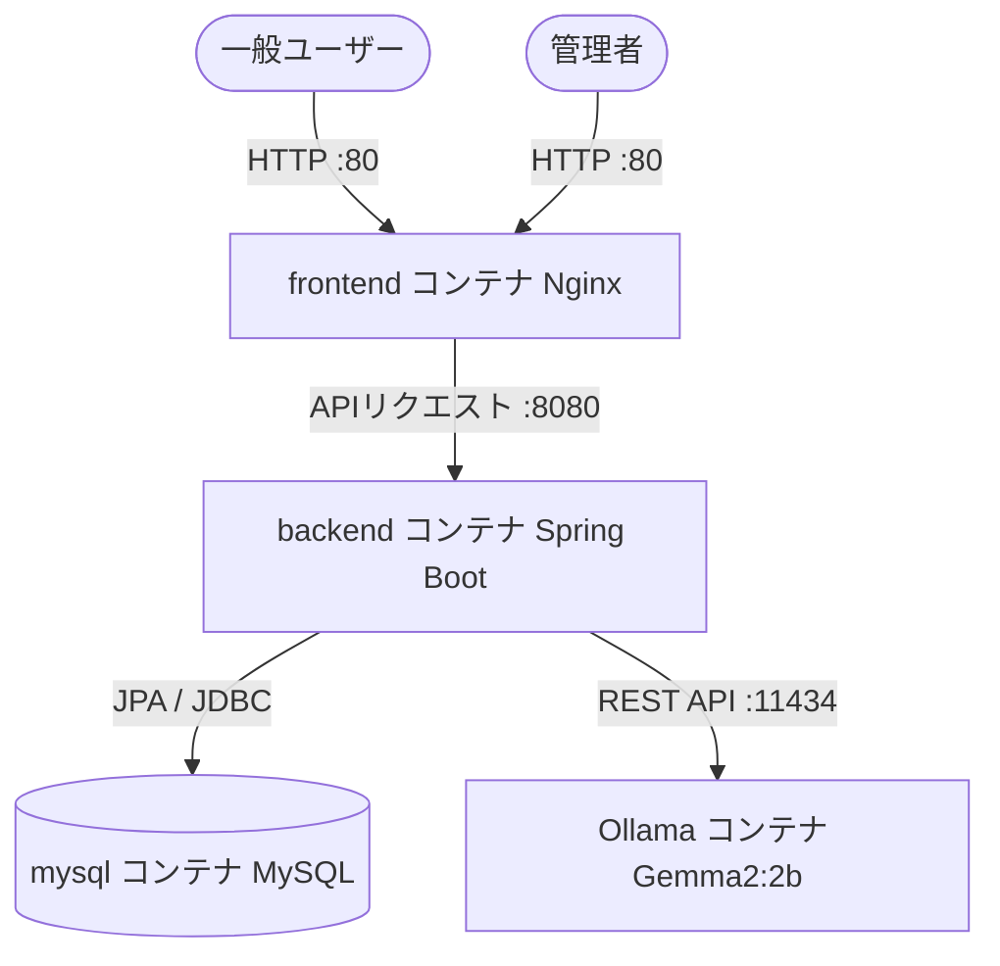

# 🗺️ 特産品マップ ＆ AI評価分析システム
## 詳細システム設計・機能仕様書 (Technical Specifications Document)

本ドキュメントは、特産品マップアプリケーション、および今回新たに統合された「ユーザー評価管理・Gemma2 AI分析ダッシュボード」の全画面、バックエンドアーキテクチャ、API、セキュリティ対策、データ構造について、極めて詳細に解説した技術仕様書です。

---

## 🏛️ 1. システム全体概要 (System Architecture)

本システムは、Dockerコンテナ化されたマルチサービスアーキテクチャで構成されており、ローカル環境で高速かつセキュアに動作します。



### 🖥️ 技術スタック
*   **フロントエンド:** Vanilla HTML5, CSS3 (プレミアムダーク/ネオンテーマ), Vanilla JavaScript (ES6+), [marked.js](https://cdn.jsdelivr.net/npm/marked/marked.min.js) (AI Markdownパース用)
*   **バックエンド:** Spring Boot 3.2.5 (Java 21), Spring Data JPA, Hibernate Core
*   **データベース:** MySQL 8.0 (永続化ボリュームマウント適用)
*   **AI分析基盤:** Ollama (ローカルホスト稼働) + **Gemma2:2b** モデル
*   **インフラ/実行環境:** Docker & Docker Compose (マルチコンテナネットワーク)

---

## 📱 2. 一般公開画面 仕様 (Public Screen Specifications)

一般公開用マップ画面（`index.html`）の最下部に、本システムの核となる「ユーザー評価ツール」が配置されています。

### 2.1 UI/UX デザイン設計
*   **ダークネオンテーマの統一:** 背景は `#0d1117` を基調とし、フォーム枠にはネオンブルーのドロップシャドウ（`box-shadow: 0 0 15px rgba(0, 198, 255, 0.1)`）を適用。
*   **直感的フィードバック:** 入力中のフィールドやボタンにフォーカスすると、滑らかなトランジション（`transition: 0.3s`）でグローエフェクトが発生。

### 2.2 評価入力ツール (Rating Form)
*   **動的星評価セレクタ (Star Selector):**
    *   ★1から★5までの5つの星アイコン（`⭐`）を配置。
    *   ホバー時およびクリック時に、選択された星以下のすべての星がゴールドに輝き、右側に「大変満足」「不満」などの動的なテキストフィードバック（例：「★5：大変満足！」）をリアルタイム表示。
*   **コメント入力エリア (Comment Textarea):**
    *   ユーザーが任意の意見を入力できるプレースホルダー付き入力欄。
    *   クライアント側およびサーバー側で **「最大1000文字」** のバリデーション制限を適用。
*   **送信処理:**
    *   「評価を送信する」ボタン押下時、送信中はボタンを無効化（Double Submit防止）。
    *   送信完了時、またはエラー時に、画面上部に美麗なフェードイン/フェードアウトトースト（`Toast`）を動的生成して通知。

### 2.3 クライアント側API連携仕様
*   **エンドポイント:** `POST /api/ratings`
*   **ペイロード形式:** `application/json`
    ```json
    {
      "rating": 5,
      "comment": "UIが近未来的で使いやすく、特産品もすぐ見つかりました！"
    }
    ```

---

## 🔐 3. 管理者認証・ログイン仕様 (Admin Auth & Login)

管理用機能（`admin.html`）へのアクセスは、強固なセッションベース認証で厳重に保護されています。

### 3.1 ログイン画面
*   管理者画面にアクセスした際、有効なセッションが存在しない場合はダッシュボードを完全に非表示（`display: none`）にし、暗黒のログインフォームのみを中央にレンダリングします。
*   **認証情報:**
    *   ID: `admin`
    *   Password: `cit_DXproject.1024`

### 3.2 認証セキュリティアーキテクチャ
*   **HttpOnly & SameSite=Strict クッキー:**
    認証成功時、サーバーは暗号的に安全な256ビットのランダムトークンを `ADMIN_SESSION` クッキーとして発行します。
    *   `HttpOnly`属性により、フロントエンドのJavaScript（悪意あるXSSスクリプトなど）からトークンを読み取ることは一切不可能です。
    *   `SameSite=Strict`属性により、外部サイトからのクロスサイトリクエストにクッキーが一切添付されず、**CSRF（クロスサイトリクエストフォージェリ）攻撃を完全に遮断**します。
*   **セッション生存期間:** サーバー側の `AdminSessionService` により、メモリマップ（ConcurrentHashMap）上でセッションの有効期限を厳密に管理。

---

## 📊 4. 管理者ダッシュボード画面 仕様 (Admin Dashboard Specifications)

ログイン成功後、画面上部にネオンラインで装飾された「タブメニュー」が表示され、管理者は機能を選択できます。

```text
[ タブ1: 🍱 特産品管理 ]   [ タブ2: ⭐ 評価コメント管理 (NEW!) ]
```

---

### 4.1 タブ1: 特産品管理 (Specialty Management)
*   **データCRUD:** 特産品の登録、一覧表示、編集、削除を行うメインインターフェース。
*   **モーダル設計:** 編集および新規作成は、ダッシュボードの背景を暗くぼかす（`backdrop-filter: blur(8px)`）プレミアムなガラスモルフィズムモーダル上で実行。

---

### 4.2 タブ2: 評価コメント管理 (Ratings & AI Analytics) [詳細仕様]
本システムの目玉機能であり、視覚的・インテリジェントな意思決定を支援する3大コンポーネントで構成されています。

#### ① 📊 美麗ドーナツ型円グラフ (Visual Distribution Chart)
外部のグラフライブラリ（Chart.js等）を一切使用せず、CSSの機能のみで描画することで、ブラウザの **CSP（コンテンツセキュリティポリシー）制限を完全に回避** しつつ極めて軽量に動作します。

```text
       [   conchart  ]
     /   ★5 (Blue)    \      📊 評価分布 (平均: 4.8 / 5.0)
    |  ★4 (Green)       |     ----------------------------
    |  ★3 (Yellow)      |     ■ ★5   8件 (80.0%)
     \   ★2 (Orange)   /      ■ ★4   2件 (20.0%)
       [ ★1 (Red)    ]
```

*   **動的 conic-gradient 描画:**
    全データから★1〜★5の件数をリアルタイム集計し、以下の色分けで比率（%）を計算。JavaScriptにより `conic-gradient` の角度背景をインラインで動的適用。
    *   ★5 (青 / `#3b82f6`)
    *   ★4 (緑 / `#22c55e`)
    *   ★3 (黄 / `#eab308`)
    *   ★2 (橙 / `#f97316`)
    *   ★1 (赤 / `#ef4444`)
*   **ネオングローエフェクト:** グラフ外周に `filter: drop-shadow(0 0 10px rgba(0, 198, 255, 0.2))` を付与し、暗闇に浮かび上がる光るリングを演出。
*   **リアルタイム平均評価表示:** グラフの中央（ドーナツの穴部分）に、全件の平均星数を計算して「4.8」のように巨大フォントでリアルタイム表示。

#### ② 🌐 世界基準タイムゾーン自動追従テーブル (Ratings Table)
世界中のどの地域から管理者がアクセスしても、送信時刻が狂わない「プロダクション級」のタイムゾーン同期システムです。

*   **データ保存仕様 (DB/Java):**
    日時の保存型に **`java.time.Instant`** を採用。MySQLには自動的に協定世界時（UTC）の絶対時刻で保存されます。APIが返すJSONデータは、末尾に `Z` の付いた国際標準フォーマット（例: `2026-05-22T13:49:46Z`）になります。
*   **クライアント自動ローカライズ:**
    フロントエンド表示時、JavaScriptの以下の処理を実行。
    ```javascript
    const dateStr = new Date(item.createdAt).toLocaleString();
    ```
    これにより、ブラウザのOS設定（スマホやPCの時計設定）に基づき、**自動的にアクセス元の現地時間に100%変換**されてテーブルに表示されます。
    *   日本からのアクセス: 日本標準時（JST / UTC+9）で「22:49:34」と表示。
    *   海外からのアクセス: その国の現地時間へ自動追従。

#### ③ 🤖 Gemma2 AI自動評価分析システム (AI Analytics)
ローカルで安全に稼働しているAIモデル **Gemma2**（Ollama経由）に対し、一括した統計データとユーザーの生コメントを瞬時に読み込ませて分析するインテリジェント機能です。

```text
+--------------------------------------------------------+
|  [ 🤖 AIで評価を分析 ]                                  |
|                                                        |
|  (ローカルAI「Gemma2」が自動生成したレポート)            |
|  ### 📊 全体サマリー                                    |
|  満足度が非常に高く、特にUIデザインと高速な検索...       |
|  ...                                                   |
|                                                        |
|  ⚠️ ご注意: AIはハルシネーションを生成する可能性が...    |
+--------------------------------------------------------+
```

*   **非同期プログレッシブローディング:**
    「AIで評価を分析」ボタンを押下すると、ボタンがローディングスピナー（くるくる回るアニメーション）と「Gemma2が分析中...」の文字に切り替わり、送信処理中の誤連打を完全に防止。
*   **データコンテキスト自動生成プロンプト:**
    バックエンド側で、その瞬間の「総評価数」「星ごとの件数」「平均点」「全ユーザーコメント」を以下のテンプレートに自動結合して高度なプロンプトを作成。
    > **プロンプトテンプレート概要:**
    > 「あなたはプロのデータアナリストです。以下の統計データ【総評価数、平均点、星の内訳】と【生コメントリスト】を分析し、①全体サマリー、②ポジティブな意見、③ネガティブな改善点、④AIアドバイス の4つのセクションで構成した日本語のMarkdownレポートを作成してください。」
*   **Markdownパーサー連携:**
    AIから返却された生のテキストを、読み込んだ `marked.js` を使用してHTMLへパース（`marked.parse(data.report)`）。箇条書きや強調（太字）などが美しくダッシュボード上に展開されます。
*   **ハルシネーション（幻覚）免責警告UI:**
    AIがもっともらしい嘘（事実と異なる情報）を出力する特性に配慮し、レポート表示エリアの直下に以下の警告表示カードを常時展開。
    *   **文言:** `⚠️ ご注意: AI（Gemma2）は事実とは異なる情報（ハルシネーション）を出力する可能性があります。レポート内容は参考として活用し、正確なデータは直接コメントをご確認ください。`
    *   **UI:** ダーク背景に馴染む不透明度3%のガラスエフェクト、左端に「警告ゴールド（`var(--admin-warning)`）」の強烈な3pxアクセント縦線を配置し、一目で注意を引く安全設計。

---

## 🛡️ 5. セキュリティ設計 仕様 (Security Specification)

本システムは、大学のセキュリティ発表や実用段階の監査に耐えうる、多層防御（Defense in Depth）設計が施されています。

### 5.1 CSRF（クロスサイトリクエストフォージェリ）防御
*   **ダブルサブミットトークンパターン:**
    管理者がログインした際、セッションとは別に暗号的に安全なCSRFトークンをサーバーが生成し、フロントエンドに渡します。
*   **ダブル検証仕様:**
    管理画面からの全ての「書き換え系リクエスト（特産品登録・編集・削除、評価削除、AI分析）」は、リクエストヘッダーに **`X-CSRF-Token`** を添付して送信します。
    サーバー側では、以下の2点を厳格に検証し、1文字でも異なれば `403 Forbidden` を返して処理を即座にブロックします。
    1.  Cookieから届いた `ADMIN_SESSION` 内のCSRFトークン
    2.  カスタムヘッダー `X-CSRF-Token` から届いたCSRFトークン

### 5.2 XSS（クロスサイトスクリプティング）防御
*   **HTMLエスケープ:**
    ユーザーが入力した悪意あるスクリプト（例: `<script>stealCookie()</script>`）が管理者画面で実行されるのを防ぐため、JavaScript側でテーブル描画時に以下の特殊文字を完全に無害な文字実体参照に置き換えてレンダリングします。
    *   `&` ➔ `&amp;`
    *   `<` ➔ `&lt;`
    *   `>` ➔ `&gt;`
    *   `"` ➔ `&quot;`
    *   `'` ➔ `&#x27;`

### 5.3 SQLインジェクション防御
*   **JPA PreparedStatement プレースホルダ:**
    すべてのデータベースクエリは、Spring Data JPAの内部的なプリペアドステートメントによって実行されます。ユーザー入力値はSQL命令として解釈されず、安全な「パラメータ（値）」としてのみ処理されるため、SQLインジェクション脆弱性は根本的にゼロです。

---

## 🔌 6. バックエンド API 仕様リファレンス (API Reference)

### 6.1 一般公開エンドポイント

#### 📥 ユーザー評価の新規投稿
*   **URL:** `POST /api/ratings`
*   **認証:** 不要
*   **リクエスト形式:** `application/json`
*   **バリデーション:**
    *   `rating`: 必須。1〜5の整数。範囲外は `400 Bad Request`。
    *   `comment`: 任意。最大1000文字。超過は `400 Bad Request`。
*   **レスポンス例 (成功時 - `201 Created`):**
    ```json
    {
      "message": "評価を保存しました。"
    }
    ```

---

### 6.2 管理者専用エンドポイント (要セッション認証 ＆ CSRF検証)

#### 📋 評価一覧の取得
*   **URL:** `GET /api/ratings`
*   **認可:** `ADMIN_SESSION` Cookieが有効であること。無効時は `401 Unauthorized`。
*   **レスポンス形式:** `application/json` (最新の投稿順にソートされて返却)
*   **レスポンス例 (成功時 - `200 OK`):**
    ```json
    [
      {
        "id": 12,
        "rating": 5,
        "comment": "デザインが非常に美しいですね！",
        "createdAt": "2026-05-22T13:56:45Z"
      },
      {
        "id": 11,
        "rating": 4,
        "comment": "検索が高速で素晴らしいです。",
        "createdAt": "2026-05-22T13:48:12Z"
      }
    ]
    ```

#### 🗑️ 評価の削除
*   **URL:** `DELETE /api/ratings/{id}`
*   **認可:** `ADMIN_SESSION` Cookie有効 ＆ `X-CSRF-Token` ヘッダーの一致。無効時は `403 Forbidden`。
*   **レスポンス例 (成功時 - `200 OK`):**
    ```json
    {
      "message": "評価を削除しました。"
    }
    ```

#### 🤖 Ollama (Gemma2) によるAI一括分析
*   **URL:** `POST /api/admin/ratings/analyze`
*   **認可:** `ADMIN_SESSION` Cookie有効 ＆ `X-CSRF-Token` ヘッダーの一致。無効時は `403 Forbidden`。
*   **処理:** DB内の全評価データを集約し、Ollama API（`host.docker.internal:11434/api/generate`）へ転送。
*   **レスポンス例 (成功時 - `200 OK`):**
    ```json
    {
      "report": "### 📊 全体サマリー\nユーザー全体の満足度は平均4.8点と極めて高く..."
    }
    ```

---

## 💾 7. データベース設計 (Schema Design)

### 📋 `ratings` テーブル構造 (MySQL)
本システムの評価情報を格納するテーブルのDDL構造です。

| カラム名 (Column) | データ型 (Type) | 制約 (Constraint) | 説明 (Description) |
| :--- | :--- | :--- | :--- |
| `id` | `BIGINT` | `PRIMARY KEY`, `AUTO_INCREMENT` | 評価データのユニーク識別ID |
| `rating` | `INT` | `NOT NULL` | 星評価数 (1〜5) |
| `comment` | `VARCHAR(1000)` | `DEFAULT ""` | ユーザーからの評価コメント |
| `created_at` | `TIMESTAMP(6)` | `NOT NULL` | 投稿日時 (世界標準時 UTC 保存) |
